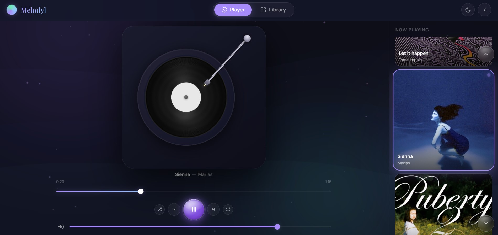
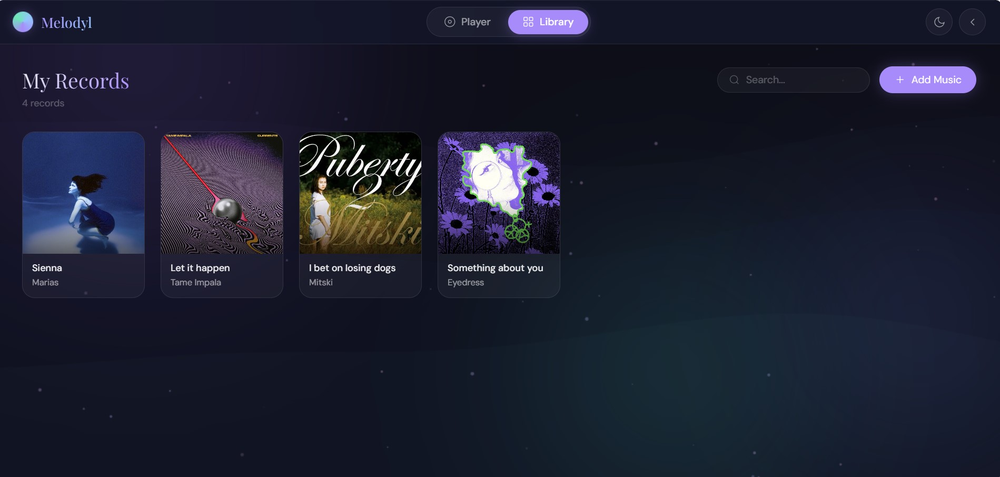

# Melodyl

A vinyl-inspired music player that combines modern digital audio playback with the timeless experience of a physical turntable.

## Overview

Melodyl is a web and desktop music player designed to transform a personal music collection into an interactive listening experience. Instead of relying on traditional playlists and static interfaces, Melodyl recreates the feeling of using a real turntable while maintaining the convenience of digital audio.

Users can upload their own music files, assign custom album artwork, and enjoy their collection through an animated vinyl player.

## Light and Dark Modes

Melodyl includes both light and dark themes to suit different environments and preferences. The interface transitions smoothly between themes while maintaining a clean and elegant design.

## Interactive Vinyl Player

The player is the core of the Melodyl experience.

When a track is selected, a vinyl record is automatically generated using the album artwork associated with that song. During playback, the record rotates smoothly and the tonearm moves into position just like a physical turntable.

Playback controls are located directly beneath the player for easy access.

## Personal Music Library

Melodyl allows users to build and manage their own music collection.

Users can:

- Upload MP3, WAV, FLAC, and other audio formats
- Add custom song titles
- Add artist information
- Upload custom album covers
- Browse their music library
- Instantly load tracks into the vinyl player

## Features

- Local music file support
- Vinyl-inspired playback experience
- Animated record rotation
- Dynamic tonearm movement
- Custom album artwork
- Personal music library management
- Light and dark themes
- Responsive web application
- Desktop application support
- Smooth animations and transitions

## Vision

Melodyl was created to combine the convenience of digital music with the visual and emotional appeal of vinyl records, providing a listening experience that is both modern and nostalgic.
